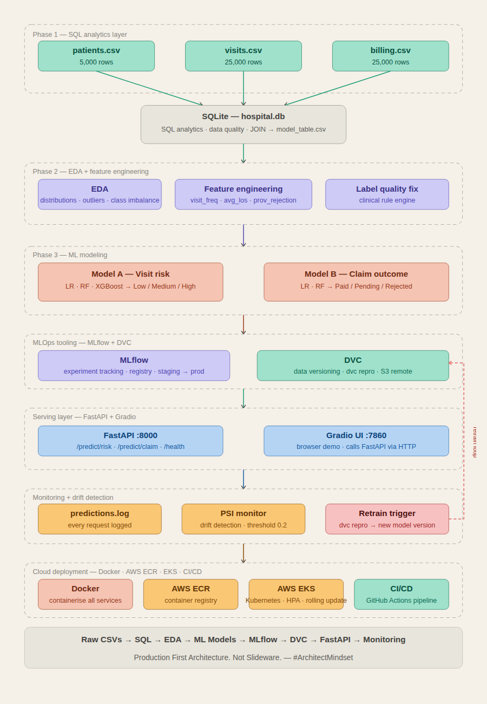
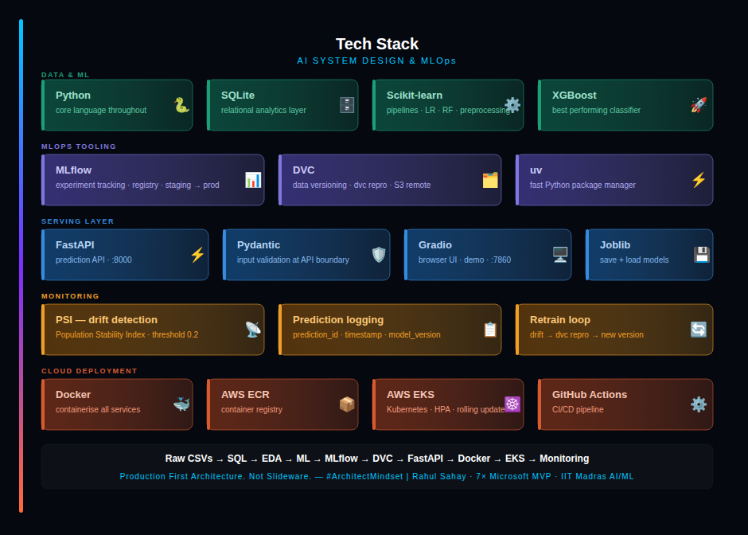

# 🏥 Healthcare AI System


An end-to-end enterprise ML system built on real hospital data — from raw CSVs to AWS Kubernetes deployment, with full MLOps tooling, monitoring, and governance.
- Data Engineering (SQL + Feature Pipeline)
- Machine Learning (Classification Models)
- MLOps (MLflow + DVC + Versioning)
- Model Serving (FastAPI + Gradio)
- Cloud Deployment (Docker + AWS ECR + EKS)
- CI/CD Automation (GitHub Actions)
- Monitoring (Drift detection with PSI)

---



---

## ⚙️ Tech Stack



---

## 🎯 What This System Does

| Model | Input | Prediction | Business Value |
|---|---|---|---|
| **Visit Risk Classifier** | Patient + Visit data | Low / Medium / High risk | Helps hospital ops teams triage and allocate staff proactively |
| **Claim Outcome Predictor** | Billing + Visit data | Paid / Pending / Rejected | Helps finance teams detect rejection-prone claims before submission |

---

## 📊 Business Impact

### 🏥 Healthcare Operations
- Early identification of high-risk patients
- Better ICU / ER resource allocation

### 💰 Financial Optimization
- Predict claim rejection before submission
- Reduce revenue leakage

### ⚡ System Efficiency
- Automated ML pipeline reduces manual retraining
- Real-time API inference for hospital systems

---

## 🏗️ System Architecture

```
Raw Hospital Data
(patients.csv · visits.csv · billing.csv)
        │
        ▼
SQL Analytics Layer
(SQLite · hospital.db)
        │
        ▼
EDA + Feature Engineering
(distributions · outliers · feature creation · label fixes)
        │
        ▼
ML Models
(Model A — Visit Risk · Model B — Claim Outcome)
        │
        ▼
MLOps Layer
├── MLflow (experiment tracking)
├── DVC (data versioning + pipelines)
├── Model Artifacts (joblib files)
├── Feature Schema (single source of truth)
└── Predictions Log (audit trail)
        │
        ▼
Serving Layer
├── FastAPI (prediction APIs)
├── Pydantic (input validation)
├── Gradio UI (demo interface)
└── PSI Monitor (drift detection)
        │
        ▼
Cloud Deployment
├── Docker (containerisation)
├── AWS ECR (image registry)
├── AWS EKS (Kubernetes deployment)
├── GitHub Actions (CI/CD pipeline)
└── Live Endpoint (scalable inference)
        │
        ▼
Retrain Feedback Loop
(drift → DVC repro → new model version)
```

---

## 📁 Project Structure

```
Healthcare/
├── data/
├── db/
│   └── hospital.db
├── notebooks/
├── src/
│   ├── training_pipeline.py
│   ├── feature_engineering.py
│   └── model_training/
├── api/
│   ├── main.py
│   ├── routers/
│   ├── schemas/
│   └── services/
├── ui/
│   └── gradio_app.py
├── monitoring/
│   ├── psi_monitor.py
│   └── logger.py
├── models/
│   ├── risk_model.joblib
│   └── claim_model.joblib
├── outputs/
│   ├── model_table.csv
│   └── feature_schema.json
├── mlruns/
├── mlartifacts/
├── mlflow.db
├── logs/
│   └── predictions.log
├── dvc-storage/
├── dvc.yaml
├── dvc.lock
├── report/
│   ├── model_card.md
│   └── monitoring_strategy.md
├── tests/
├── Dockerfile
├── docker-compose.yml
├── .github/workflows/
│   └── ci_cd.yml
├── requirements.txt
└── README.md
```

---

## 🗄️ Dataset Overview

### patients.csv — 5,000 rows

| Column | Type | Description |
|---|---|---|
| patient_id | int | Primary key |
| age | int | Patient age (1–90) |
| gender | str | M / F |
| city | str | Hyderabad, Pune, Chennai, Bangalore, Mumbai, Delhi |
| insurance_provider | str | SecureLife, HealthPlus, CareOne, MediCareX |
| chronic_flag | int | 1 = chronic condition |
| registration_date | date | First visit |

---

### visits.csv — 25,000 rows

| Column | Type | Description |
|---|---|---|
| visit_id | int | Primary key |
| patient_id | int | Foreign key |
| visit_date | date | Visit date |
| department | str | Cardiology, ICU, ER, etc. |
| visit_type | str | ER / OPD / ICU |
| length_of_stay_hours | float | Stay duration |
| risk_score | str | Target (Low / Medium / High) |
| doctor_id | int | Doctor ID |

---

### billing.csv — 25,000 rows

| Column | Type | Description |
|---|---|---|
| bill_id | int | Primary key |
| visit_id | int | Foreign key |
| billed_amount | float | Charged amount |
| approved_amount | float | Approved amount |
| claim_status | str | Paid / Pending / Rejected |
| payment_days | float | Payment delay |
| billing_date | date | Billing date |

---

## 📊 Model Performance

| Model | Algorithm | Test Accuracy | Weighted F1 |
|---|---|---|---|
| Visit Risk | Logistic Regression | ~91% | 0.90 |
| Visit Risk | Random Forest | ~95% | 0.94 |
| Visit Risk | XGBoost (final) | ~95% | 0.94 |
| Claim Outcome | Logistic Regression | ~47% | 0.43 |
| Claim Outcome | Random Forest | ~55% | 0.51 |

> ⚠️ Key insight: Data quality improvement had more impact than model tuning.

---

## 🔍 Key Points

- Data quality improvement → major performance jump
- Time-based split avoids leakage
- Class imbalance handling (SMOTE, weights)
- Overfitting analysis (train vs test gap)
- Fairness checks across demographics
- Production-ready API with logging + validation
- Drift detection using PSI

---

## 👨‍💻 Author

**Abdullah**  
AI/ML Engineer  
www.linkedin.com/in/chabdullah7
